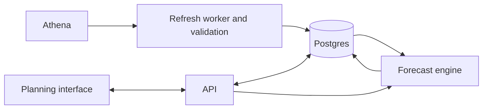

# Proposed architecture

## Data flow



Athena supplies historical actuals. Postgres stores validated snapshots, scenarios, assumptions, forecast results, and audit history. Assumption changes calculate against stored snapshots rather than querying Athena.

## Proposed stack

- React and TypeScript interface.
- Python FastAPI API and Python forecast module with decimal arithmetic.
- Managed Postgres for persistent data and a durable background job table.
- Separate web and worker process groups on Fly.io, initially in one region near the database.
- Company SSO and application-level permissions; confirm whether access should also be private through Tailscale.

Reuse the existing dashboard's stack and authentication if code review establishes that this reduces maintenance.

## Actuals refresh

Query approved Athena views through restricted server-side AWS access and a dedicated workgroup. Validate uniqueness, completeness, and reconciliation before atomically publishing a snapshot. Preserve the last successful snapshot on failure. Record query/version, refresh timestamp, and the last complete accounting month separately.

Pin each scenario version to its actuals snapshot. New actuals become available for an explicit reforecast; approved plans do not silently change. Mark incomplete months as provisional and define the actuals/forecast cutoff.

## ARR model

```text
Closing ARR = Opening ARR + New + Expansion - Contraction - Churn
Next month's Opening ARR = This month's Closing ARR
```

Contraction and churn inputs represent positive loss amounts. Percentage assumptions identify their denominator, eligible population, and time period. Annual assumptions require an explicit monthly allocation rule.

Use separate Enterprise and Self-Serve assumptions. Customer overrides replace the corresponding general assumption for that customer and movement. Prevent double counting, impossible negative balances, and losses beyond the eligible ARR base. Use stable organization IDs and preserve historical segment assignments. Segment transfers are not company-level new ARR or churn.

The reference dashboard describes YTD expansion/contraction against opening-year ARR. Reconcile this with monthly movement definitions before sharing calculation logic; YTD category changes can differ from monthly economic movements.

## Revenue model

Calculate revenue separately from year-end ARR. Use effective dates or explicit monthly timing conventions for subscription movements. Model usage/overages and non-recurring revenue separately without double counting amounts already included in recurring revenue. Full-year revenue combines completed actual months with forecast months.

Average monthly ARR divided by 12 is only a labeled planning approximation where appropriate. Contract schedules and Finance's recognition rules take precedence where material.

## Persistence

- Actuals snapshots: source lineage, completeness, validation status.
- Monthly actuals: organization, segment, product where available, currency, ARR, revenue.
- Scenarios: name, owner, fiscal calendar, horizon.
- Scenario versions: snapshot, cutoff, draft/approved status.
- Assumptions: scope, month, movement, amount/rate, denominator, notes.
- Customer overrides: organization, effective month, replacement scope.
- Forecast runs/results: monthly outputs, input version, engine version.
- Audit events: actor, timestamp, old/new values.

Reproduce every run from snapshot + assumptions + engine version. Use optimistic concurrency to reject conflicting saves rather than overwrite another user's work.

## Interface

Planning overview; monthly assumptions grid; customer overrides; scenario comparison; actuals and reconciliation; version history. Show actuals beside forecast inputs and distinguish calculated cells. Support spreadsheet paste and CSV export.

## Validation and operations

Test monthly ARR reconciliation, override precedence, actuals cutoffs, timing effects, segment transfers, and reproducibility. Run refreshes through a persistent worker or explicit scheduler with retries and duplicate-job protection. Monitor failed refreshes and stale actuals. Keep secrets out of source control. Use managed database backups and verify recovery procedures.

Before choosing Fly Managed Postgres, verify current region availability and operational coverage, including security patching, upgrades, and alerting.

## Decisions before implementation

1. Authoritative Athena views and approved ARR/revenue definitions.
2. Fiscal year, reporting currency, and FX policy.
3. Actuals cutoff and source refresh cadence.
4. Percentage denominators and monthly allocation rules.
5. Subscription revenue timing and recognition detail.
6. Customer versus segment planning detail and override precedence.
7. Repository owner, authentication provider, and private access requirements.

## References

- [Athena workgroups](https://docs.aws.amazon.com/athena/latest/ug/workgroups-manage-queries-control-costs.html)
- [Fly process groups](https://fly.io/docs/app-guides/multiple-processes/)
- [Fly Managed Postgres](https://fly.io/docs/mpg/)

Proposal prepared 7 September 2026. This document contains no customer actuals or credentials.
